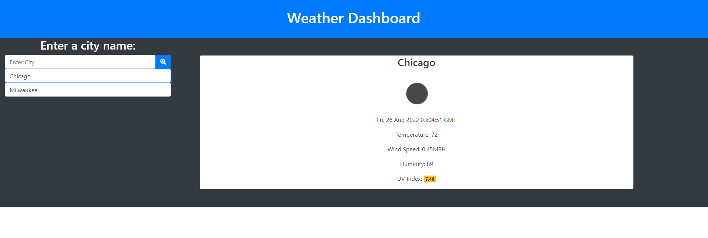

# Weather-Dashboard

## Purpose of the Weather Dashboard

The weather dashboard allows a user to input any city and receive current and forecasted weather conditions. This could be useful in planning a normal week at home, or a vaction to a new location.

## Deployed Link

Live link:  https://aumcintyre.github.io/Weather-Dashboard/

Repo link: https://github.com/aumcintyre/Weather-Dashboard/

## Screenshot

## My Experience

This was a serious learning curve for me. The biggest issue I ran into was simply with the fetch function. Once I was able to lay that out correclty and see the object data that I was working with, each step after that got easier. I again ran into trouble on the 5 day forecast when trying to reference the correct data. After a little time in office hours, I was able to create an index that I could pass to the data I was pulling, which would give me the results I was looking for. Doing this alongside the first project felt very overwhelming at first, but after the past few days I've become far more comfortable pulling and manipulating data from APIs

## Credit

### Coding Help
<ul>
<li>StackOverflow</li>
<li>MDN WebDocs</li>
<li>GitHub</li>
<li>Office Hours</li>
<li>AskBCS</li>
</ul>

### Images
<ul>
<li>Personal Screenshot</li>
</ul>
